# Guia visual do Blip Addons 2.0

Este guia mostra onde encontrar e como usar os recursos da versão **2.6.2**. Para instalar, siga [o passo a passo do Chrome](INSTALACAO.md). As imagens do popup foram capturadas da interface compilada com as configurações padrão, em uma prévia local; as imagens do Builder foram capturadas no tema escuro. As capturas mostram controles e exemplos, sem executar alterações em massa no fluxo.

## Abrir e navegar pelo popup

Clique no ícone **Blip Addons 2.0** na barra de extensões do Chrome. O menu lateral separa os ajustes do Builder, as personalizações e o DEV mode. O idioma fica no canto superior direito.

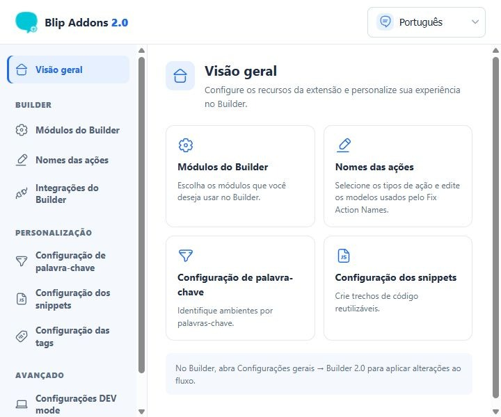

### Escolher os módulos do Builder

Abra **Módulos do Builder** e use as chaves para exibir ou ocultar as seções da aba **Builder 2.0**. As escolhas são salvas automaticamente e chegam às abas abertas da Blip. **Verificar inconsistências no fluxo**, **Estatísticas do Bot** e **Quality Checker** começam desligados.

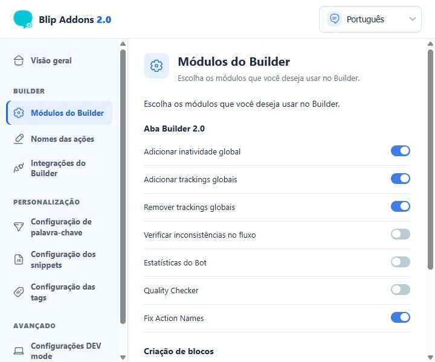

Role até o fim para encontrar **Nova integração**. Desligar essa chave oculta a opção de criar novos blocos de integração; os blocos já existentes continuam disponíveis para edição.

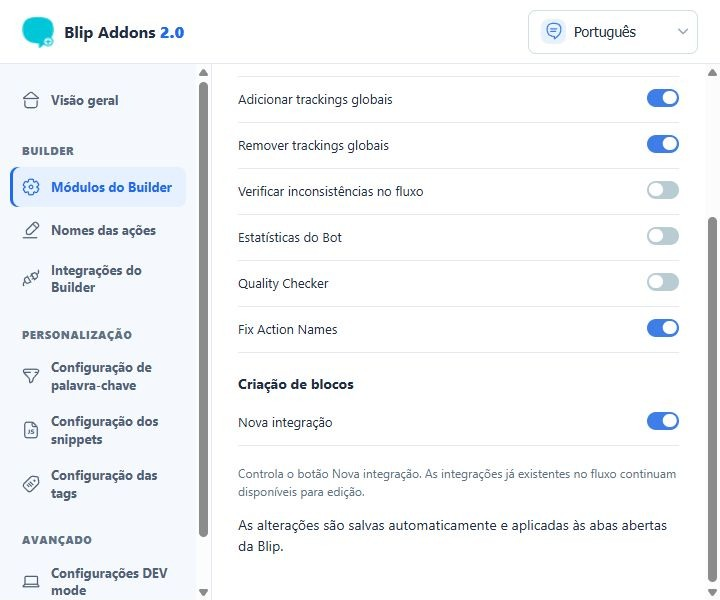

### Configurar os nomes das ações

Em **Nomes das ações**, marque os tipos que deseja padronizar e edite o **Modelo do nome**. Abaixo de cada campo aparecem os marcadores disponíveis, como `{{category}}` para tracking. O mesmo modelo de Script é usado para `ExecuteScript` e `ExecuteScriptV2`.

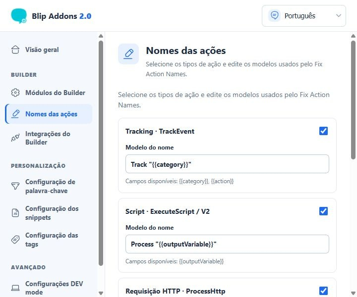

No fim da página, escolha se variáveis devem aparecer como `{variavel}` no nome e clique em **Salvar modelos**. **Restaurar padrões** redefine esses modelos. Salvar ou restaurar aqui não renomeia o fluxo aberto; a aplicação é feita no Builder, como mostrado [adiante](#aplicar-os-nomes-das-ações).

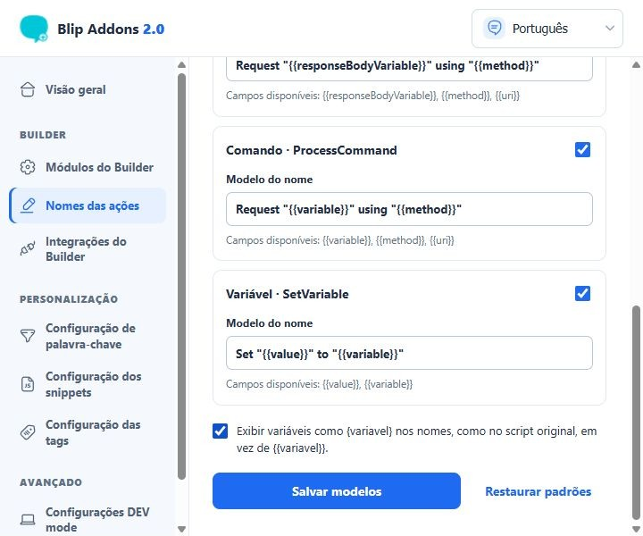

### Conhecer as integrações

**Integrações do Builder** lista os serviços oferecidos por **Nova integração** e explica onde criar o bloco. Cada integração usa um bloco próprio; serviços que dependem de plugin precisam estar instalados ou ativados na Blip Store.

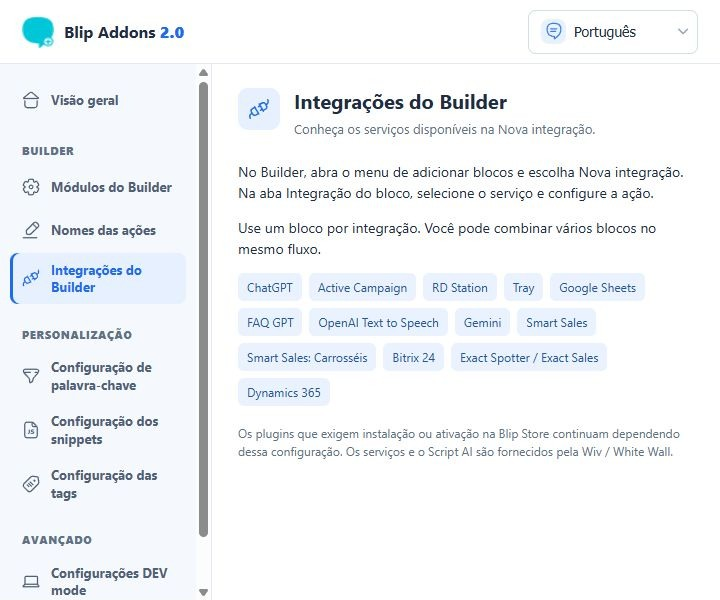

### Personalizar palavras-chave, snippets e tags

Em **Configuração de palavra-chave**, defina os termos usados para reconhecer os ambientes de produção, homologação, beta e desenvolvimento. Clique em **Salvar**; para esse ajuste, recarregue as páginas do Builder já abertas.

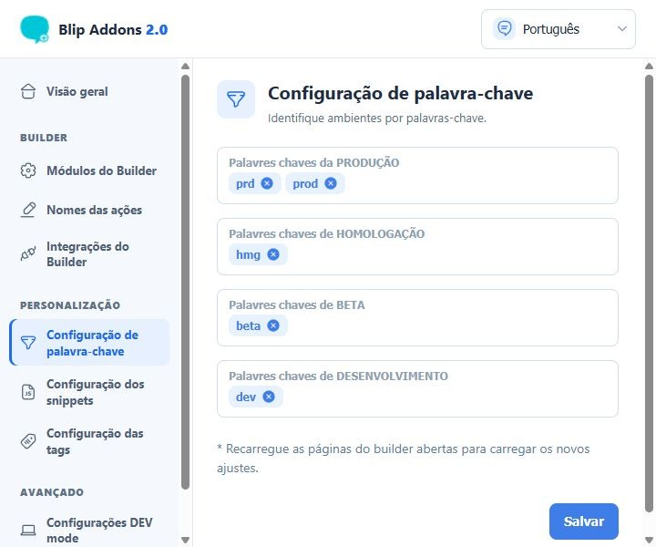

Em **Configuração dos snippets**, clique em **Add Snippet**, abra o item criado, preencha **Nome do Snippet** e **Código a ser gerado** e clique em **Salvar**.

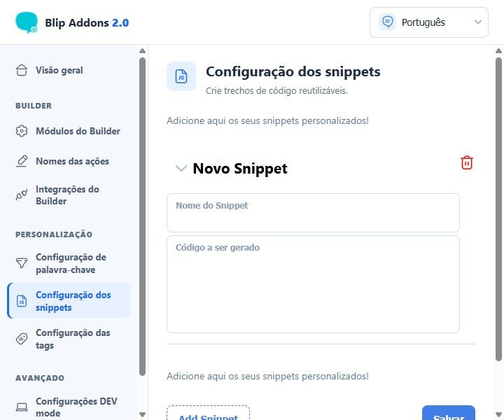

Em **Configuração das tags**, a chave **Habilitar auto tag** controla a atribuição automática. Abra uma ação para escolher sua cor e definir se aquela tag fica ativa; depois clique em **Salvar** no fim da lista.

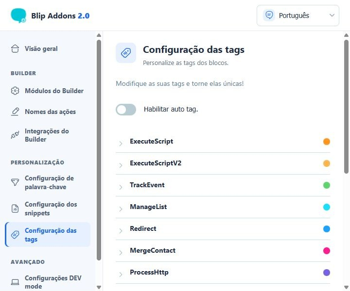

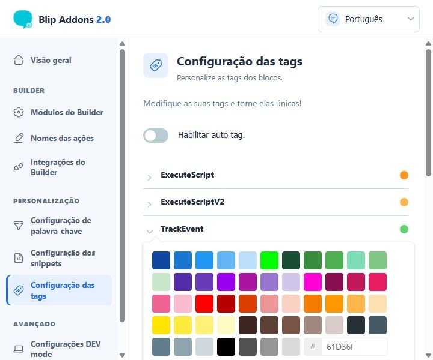

### Ajustes avançados

**Configurações DEV mode** reúne opções de visualização e limpeza da interface do Builder. Ative somente as opções que fizerem sentido para seu trabalho.

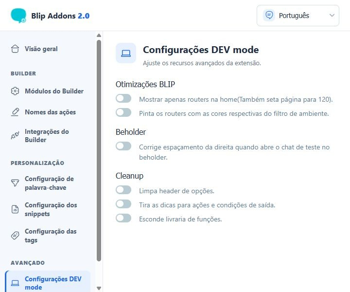

## Usar dentro do Blip Builder

Abra um bot no Builder, clique no ícone de **Configurações gerais** na barra à esquerda e selecione a aba **Builder 2.0**, à direita de **Ações globais**. Expanda a seção desejada. Abrir a aba ou expandir uma seção não altera o fluxo.

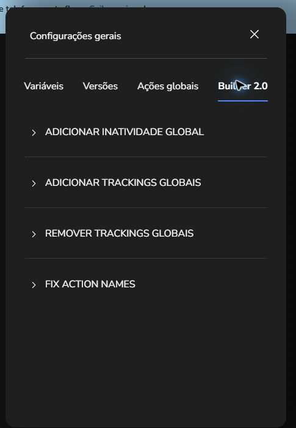

### Definir inatividade global

Em **Adicionar inatividade global**, informe o limite em minutos. A chave **Manter limite de espera se já estiver definido** preserva valores existentes quando ativada. **Definir** abre uma confirmação para aplicar a alteração ao fluxo aberto; o ícone circular ao lado abre a confirmação para remover a inatividade global. Confira o fluxo e publique a versão quando estiver pronta.

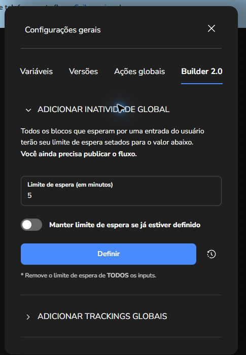

### Adicionar trackings globais

Abra **Adicionar trackings globais**, clique em **Adicionar** para criar uma linha e preencha **Key** e **Value**. A opção **Apagar trackings globais definidas** limpa as trackings anteriores antes da aplicação. Clique em **Definir** e confirme para aplicar ao fluxo aberto; depois confira o resultado antes de publicar.

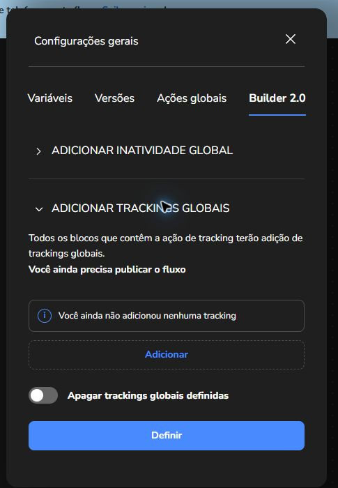

### Remover trackings globais

Em **Remover trackings globais**, adicione as chaves que quer retirar e clique em **Remover**. **Remover Todas** retira as trackings globais de todas as ações, conforme indicado na própria tela. Os dois comandos pedem confirmação; revise a seleção antes de confirmar e publicar.

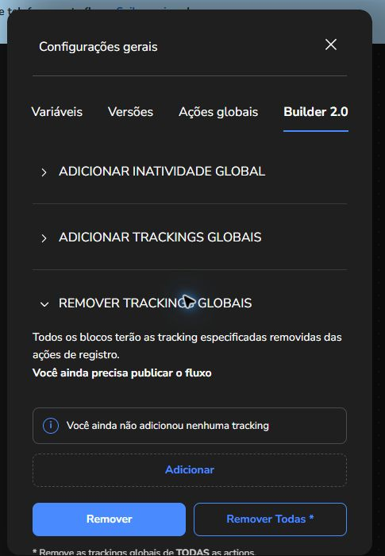

### Aplicar os nomes das ações

Configure e salve primeiro os modelos no popup. No Builder, expanda **Fix Action Names** para conferir os tipos ativos e clique em **Aplicar**. O ícone circular restaura os modelos padrão da extensão; ele não desfaz nomes já alterados no fluxo.

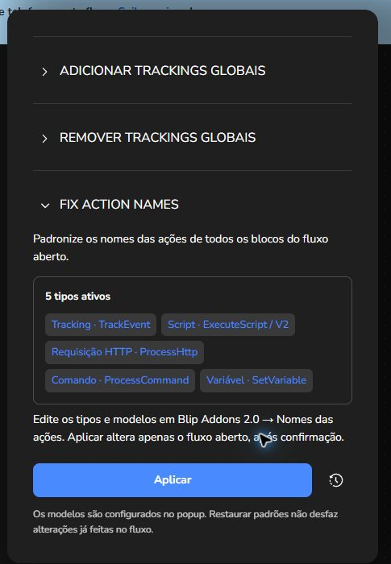

O Builder pede confirmação antes de renomear as ações do fluxo aberto. **Cancelar** não faz alterações. Depois de confirmar, confira os nomes e publique o fluxo quando estiver pronto.

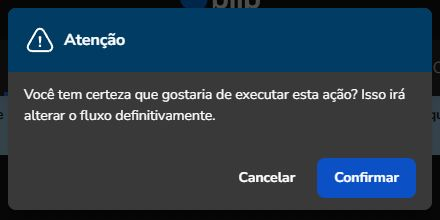

### Criar uma nova integração

Clique no **+** da barra lateral do Builder e escolha **Nova integração**. No bloco criado, abra a aba **Integração**, selecione o serviço e configure a ação. Repita com outros blocos se precisar de mais de uma integração no mesmo fluxo. Se a opção não aparecer, confira se **Nova integração** está ligada em **Módulos do Builder** no popup.

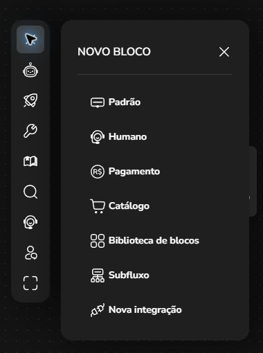

Para requisitos dos plugins, atualização da extensão e comportamento das preferências, consulte [Instalação e uso](INSTALACAO.md). Para os marcadores aceitos por **Fix Action Names**, consulte [Configuração dos modelos](FIX-ACTION-NAMES.md).
