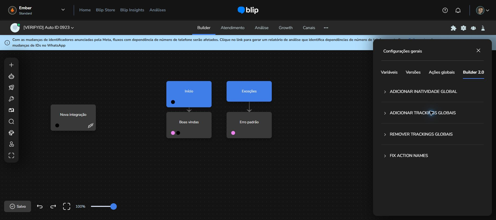
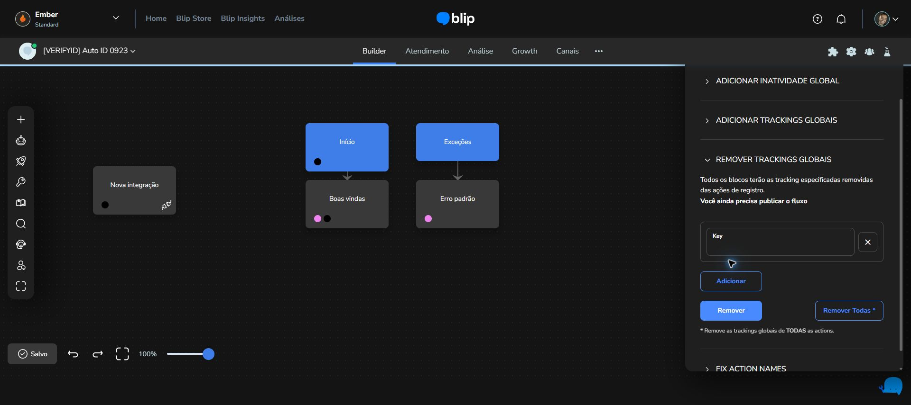
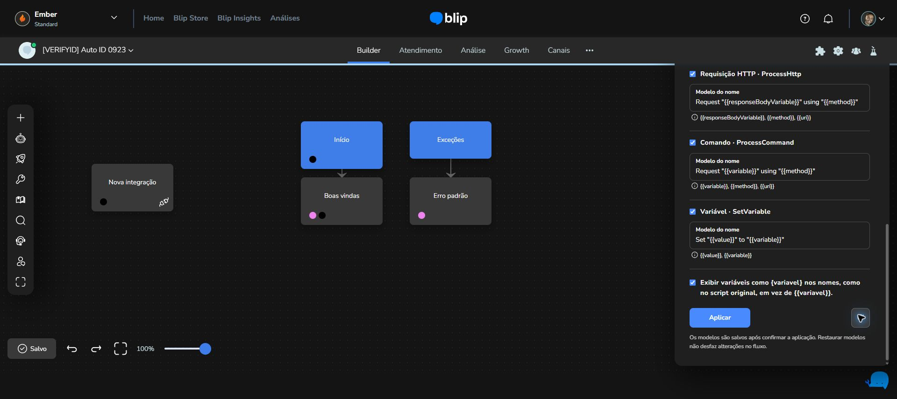
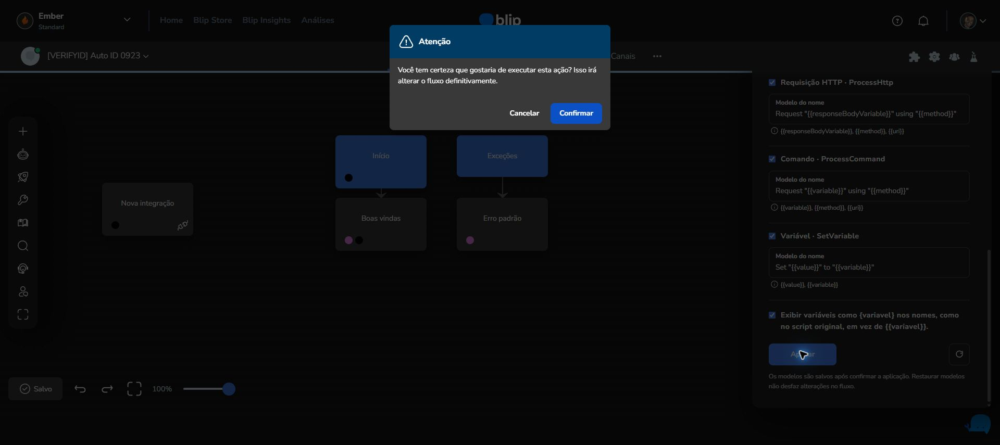

# Validação do pacote 2.5.0

Resultado: **build concluído e 19 testes automatizados aprovados** com Node.js 22.20.0 e npm 11.6.1, no Windows. Base Addons 1.3.9, Fix Action Names, configuração dos módulos e aba nativa nas configurações gerais.

| Teste | Resultado |
| --- | --- |
| Manifesto MV3 com identidade própria, permissão storage e recursos declarados presentes | Aprovado |
| Arquivos de execução do Better Blip Builder idênticos aos originais por SHA-256 | Aprovado |
| Sintaxe dos scripts de entrada e ausência de bundles JavaScript de desenvolvimento baseados em eval | Aprovado |
| Helper original cria bloco `ww:` e grava configuração via controlador do Builder | Aprovado |
| Os dois módulos juntos montam o botão/painel de integrações com 13 opções e a aba Builder 2.0, sem a estrelinha | Aprovado |
| Mensagens alheias são ignoradas; texto comum não quebra o paste; colagem de integração funciona após cleanup | Aprovado |
| Popup abre as seis seções, exibe três idiomas, alterna/persiste idioma, ajustes DEV mode e oito chaves de módulos sem loop | Aprovado |
| Botão de comentários na segunda barra, aba com estatísticas/Quality Checker, criação/busca de comentário em integração e cópia sem alterar comentários da origem | Aprovado |
| Todas as referências estáticas de tradução resolvem em português, inglês e espanhol | Aprovado |
| Inicialização espera preferências salvas e propaga mudanças sem loop de gravação | Aprovado |
| Snippets capturam Monaco não global, preservam a função anterior e descartam o provider no cleanup | Aprovado |
| Fix Action Names cobre os cinco tipos e Script V2, percorre blocos e estruturas aninhadas e altera somente títulos | Aprovado |
| Marcadores repetidos, valores com caracteres de substituição, chaves de variáveis, zero, false e referências cíclicas/repetidas | Aprovado |
| Campos ausentes, valores nulos/objetos, tipos desmarcados e modelos vazios são tratados sem nomes undefined ou alterações parciais | Aprovado |
| Preferências incompletas ou malformadas são normalizadas sem modificar os modelos padrão | Aprovado |
| Fix Action Names abaixo de Quality Checker, botão Aplicar com confirmação/cancelamento sem mutação, leitura do fluxo atual ao confirmar, persistência dos modelos, restauração e bloqueio enquanto carrega | Aprovado |
| Três módulos desligados por padrão, atualização da aba aberta via storage, tela vazia, valores inválidos ignorados e persistência ao reabrir | Aprovado |
| Nova integração oculta/bloqueada e reativada, edição de integração existente preservada, botões nativos intactos e leitura inicial atrasada sem sobrescrever configuração recente | Aprovado |
| Aba após Ações globais, quatro módulos iniciais, preferências sincronizadas, confirmação no tema do painel, cancelamento sem alteração de fluxo, navegação por teclado, montagem sem duplicação, reabertura e limpeza | Aprovado |

Os testes de execução carregam os scripts compilados em JSDOM, com DOM e controladores AngularJS simulados. Requisições reais aos serviços de integrações são bloqueadas nos testes. O teste de popup usa os arquivos locais produzidos pelo build.

O controle de Nova integração usa um adaptador separado, carregado em `document_start` em todos os frames, e CSS baseado nos contêineres de criação do fornecedor. Os arquivos originais do Better Blip Builder continuam idênticos. A sincronização via Chrome storage e os cliques foram simulados localmente; a execução entre contextos isolados no Chrome real permanece parte da validação no portal.

O script de empacotamento verifica a presença de `manifest.json` na raiz do ZIP e a quantidade de arquivos em relação a `dist`. Também gera `release/SHA256SUMS.txt` para os dois pacotes.

## Inspeção no portal e validação da nova aba

Em 29/09/2026, o Chrome conectado permitiu inspecionar o Builder no contrato Ember. Foram confirmados os três títulos nativos (Variáveis, Versões e Ações globais), a estrutura `bds-tab-group` / `bds-tab-item`, o provedor `bds-theme-provider` com tema escuro, os tokens de cor e os espaçamentos de campos, cabeçalhos e divisórias. Também foi confirmado que a instalação 2.3.0 mostra quatro módulos na estrelinha, com inconsistências, estatísticas e Quality Checker desabilitados.

A implementação 2.4.0 acrescenta um `bds-tab-item` ao grupo existente, sem substituir as abas do portal. Usa os mesmos formulários da estrelinha e herda os tokens de tema do contêiner. A compatibilidade do contrato público do componente foi conferida no pacote oficial `blip-ds` 1.320.3, sem atualizar as dependências do projeto.

A automação bloqueou a abertura de `chrome://extensions` por política de URL. Após o usuário recarregar a extensão e a página, a nova aba apareceu à direita de Ações globais no Chrome. Foram verificados os quatro módulos habilitados, a edição do tempo de inatividade, a abertura do formulário de tracking e a prévia de Fix Action Names (zero ações candidatas nesse fluxo). Nenhuma aplicação em massa foi executada.

A inspeção visual encontrou uma regra global do portal que acrescentava `padding: 36px 0` às seções. O estilo da nova aba foi ajustado para remover esse espaçamento herdado e manter os 24px/32px do conteúdo, os 10px/5px dos cabeçalhos e as divisórias com margens de 20px observados na interface nativa. Após a segunda recarga feita pelo usuário, a revisão no Chrome confirmou `padding: 0px` nas seções, uma única aba adicionada à direita de Ações globais e os quatro módulos visíveis no tema escuro.

## Mudanças da versão 2.5.0

A estrelinha foi removida do conjunto de recursos carregados pelo Builder. A aba agora se chama **Builder 2.0**. Os formulários de inatividade e trackings usam ações azuis, campos agrupados e controles de remoção acessíveis. Fix Action Names apresenta só **Aplicar** e o ícone de restauração à direita. Ao clicar em Aplicar, valida os modelos e abre a mesma janela de confirmação usada pelas demais operações; os títulos só mudam depois de confirmar. O botão da janela também usa a cor primária da Blip.

Os testes locais verificaram a ausência da estrelinha, os controles da nova aba, cancelamento sem alterações no fluxo, aplicação após confirmação e persistência das preferências. Após a recarga da extensão e da aba da Blip, a versão 2.5.0 também foi conferida no Chrome conectado ao contrato Ember: a estrelinha não aparece, a aba **Builder 2.0** contém os quatro módulos habilitados e os formulários de adicionar/remover trackings cabem no painel sem rolagem horizontal. A largura calculada do botão de excluir linha e do ícone de restauração é de 40 px. A janela de confirmação abre com cabeçalho e botão azuis; foi cancelada sem aplicar nomes. O Builder permaneceu com o indicador **Salvo**. Nenhuma operação em massa foi executada no bot real.

Não houve erros atribuídos ao módulo nas interações verificadas. O console também contém erros do portal/telemetria já presentes no carregamento, fora do escopo desta mudança. Os testes não validam a disponibilidade dos endpoints da White Wall/Wiv nem a instalação dos plugins no contrato.

Nenhum fluxo real foi criado, alterado ou publicado para esta entrega. O procedimento recomendado para concluir a homologação está em `INSTALACAO.md`.
